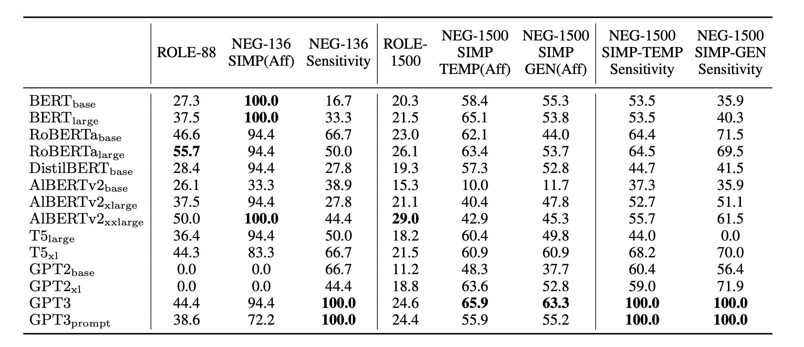

+++
title="Larger Probes Tell a Different Story: Extending Psycholinguistic Datasets Via In-Context Learning"
date=2023-03-29
slug="larger-probes"
description="N. Shivagunde, V. Lialin, A. Rumshisky"

[extra]
link = "https://arxiv.org/abs/2305.17266"
link_description = "Paper link"
+++

Language model probing is often used to test specific capabilities of these models. However, conclusions from such studies may be limited when the probing benchmarks are small and lack statistical power. In this work, we introduce new, larger datasets for negation (NEG-1500-SIMP) and role reversal (ROLE-1500) inspired by psycholinguistic studies. We dramatically extend existing NEG-136 and ROLE-88 benchmarks using GPT3, increasing their size from 18 and 44 sentence pairs to 750 each. We also create another version of extended negation dataset (NEG-1500-SIMP-TEMP), created using template-based generation. It consists of 770 sentence pairs. We evaluate 22 models on the extended datasets, seeing model performance dip 20-57% compared to the original smaller benchmarks. We observe high levels of negation sensitivity in models like BERT and ALBERT demonstrating that previous findings might have been skewed due to smaller test sets. Finally, we observe that while GPT3 has generated all the examples in ROLE-1500 is only able to solve 24.6% of them during probing.

<!-- more -->



We provide a new resource that dramatically extends existing probing data for negation and role reversal. The psycholinguistic datasets NEG-136- SIMP and ROLE-88 are extended to 1500 data points. We evaluate 22 models using the new data, observing that the absolute accuracy drops for most models on both tasks. However, most models do show an increased sensitivity to negation. Strik- ingly, as seen in the role reversal task, we show that GPT3 may be capable of generating the data for a task while failing to show top performance on it.

### Citation:
```bibtex
@article{Shivagunde2023LargerPT,
  title={Larger Probes Tell a Different Story: Extending Psycholinguistic Datasets Via In-Context Learning},
  author={Namrata Shivagunde and Vladislav Lialin and Anna Rumshisky},
  journal={ArXiv},
  year={2023},
  volume={abs/2303.16445}
}
```
