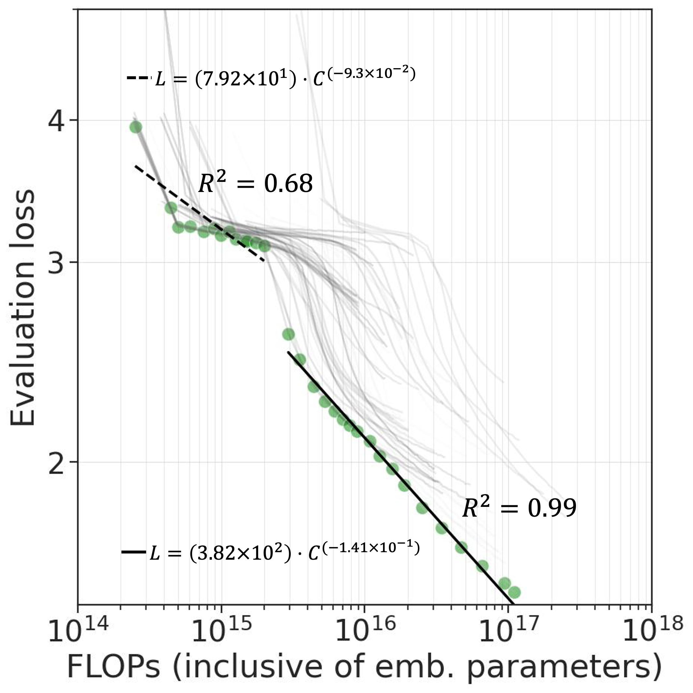

+++
title="Honey, I Shrunk the Language: Language Model Behavior at Reduced Scale"
date=2023-05-26
slug="minibert"
description="V. Deshpande, D. Pechi, S. Thatte, V. Lialin, A. Rumshisky., Accepted to ACL 2023"

[extra]
link = "https://arxiv.org/abs/2305.17266"
link_description = "Paper link"
+++

In recent years, language models have drastically grown in size, and the abilities of these models have been shown to improve with scale. The majority of recent scaling laws studies focused on high-compute high-parameter count settings, leaving the question of when these abilities begin to emerge largely unanswered. In this paper, we investigate whether the effects of pre-training can be observed when the problem size is reduced, modeling a smaller, reduced-vocabulary language. We show the benefits of pre-training with masked language modeling (MLM) objective in models as small as 1.25M parameters, and establish a strong correlation between pre-training perplexity and downstream performance (GLUE benchmark). We examine downscaling effects, extending scaling laws to models as small as ~1M parameters. At this scale, we observe a break of the power law for compute-optimal models and show that the MLM loss does not scale smoothly with compute-cost (FLOPs) below 2.2×10^15 FLOPs. We also find that adding layers does not always benefit downstream performance.

<!-- more -->



### Citation:
```bibtex
@inproceedings{deshpande-2023-shrunk,
    title = "Honey, {I} Shrunk the Language: Language Model Behavior at Reduced Scale.",
    author = "Deshpande, Vijeta  and
      Pechi, Dan  and
      Thatte, Shree  and
      Lialin, Vladislav  and
      Rumshisky, Anna",
    booktitle = "Findings of the Association for Computational Linguistics: ACL 2023",
    month = jul,
    year = "2023",
    address = "Toronto, Canada",
    publisher = "Association for Computational Linguistics",
    url = "https://aclanthology.org/2023.findings-acl.326",
    pages = "5298--5314",
}
```
