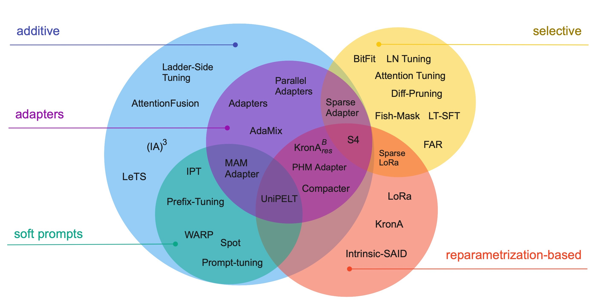

+++
title="Scaling Down to Scale Up: A Guide to Parameter-Efficient Fine-Tuning"
date=2023-03-28
slug="peft-survey"
description="V. Lialin, V. Deshpande, A. Rumshisky"

[extra]
link = "https://ieeexplore.ieee.org/document/10031235"
link_description = "Paper link"
+++

This paper presents a systematic overview and comparison of parameter-efficient fine-tuning methods covering over 40 papers published between February 2019 and February 2023. These methods aim to resolve the infeasibility and impracticality of fine-tuning large language models by only training a small set of parameters. We provide a taxonomy that covers a broad range of methods and present a detailed method comparison with a specific focus on real-life efficiency and fine-tuning multibillion-scale language models.

<!-- more -->



### Citation:
```bibtex
@misc{lialin2023scaling,
    title={Scaling Down to Scale Up: A Guide to Parameter-Efficient Fine-Tuning},
    author={Vladislav Lialin and Vijeta Deshpande and Anna Rumshisky},
    year={2023},
    eprint={2303.15647},
    archivePrefix={arXiv},
    primaryClass={cs.CL}
}
```
