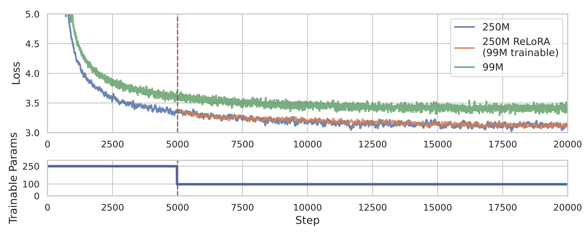

+++
title="Stack More Layers Differently: High-Rank Training Through Low-Rank Updates"
date=2023-07-11
slug="relora"
description="V. Lialin, N. Shivagunde, S. Muckatira, Anna Rumshisky"

[extra]
link = "https://arxiv.org/abs/2307.05695"
link_description = "Paper link"
+++

Despite the dominance and effectiveness of scaling, resulting in large networks with hundreds of billions of parameters, the necessity to train overparametrized models remains poorly understood, and alternative approaches do not necessarily make it cheaper to train high-performance models. In this paper, we explore low-rank training techniques as an alternative approach to training large neural networks. We introduce a novel method called ReLoRA, which utilizes low-rank updates to train high-rank networks. We apply ReLoRA to pre-training transformer language models with up to 350M parameters and demonstrate comparable performance to regular neural network training. Furthermore, we observe that the efficiency of ReLoRA increases with model size, making it a promising approach for training multi-billion-parameter networks efficiently. Our findings shed light on the potential of low-rank training techniques and their implications for scaling laws.

<!-- more -->



### Citation:
```bibtex
@misc{lialin2023stack,
    title={Stack More Layers Differently: High-Rank Training Through Low-Rank Updates},
    author={Vladislav Lialin and Namrata Shivagunde and Sherin Muckatira and Anna Rumshisky},
    year={2023},
    eprint={2307.05695},
    archivePrefix={arXiv},
    primaryClass={cs.CL}
}
```
