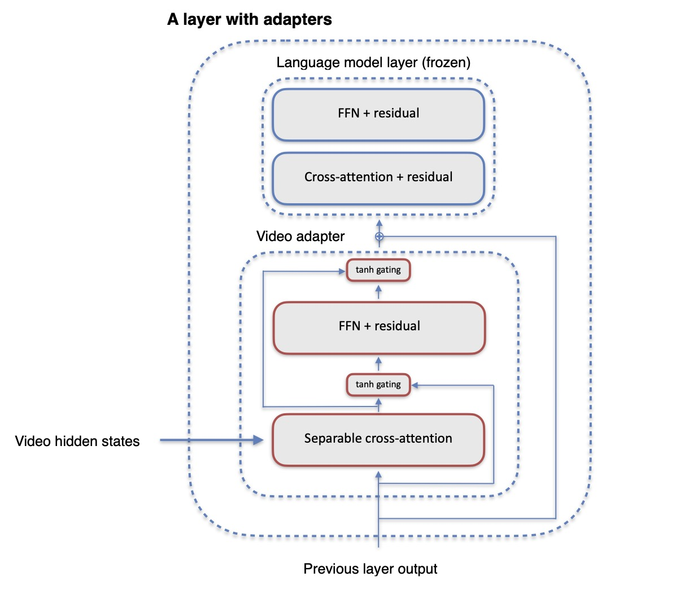
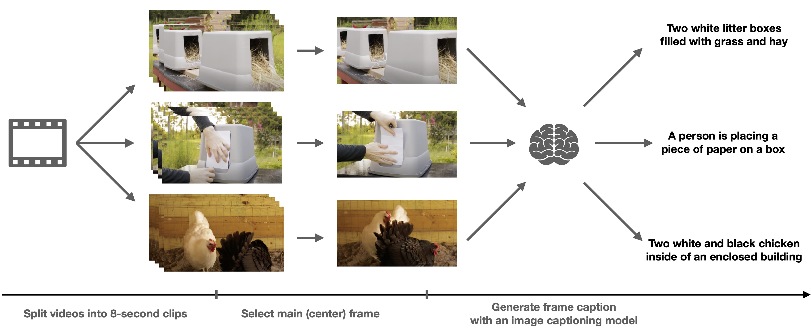

+++
title="Scalable and Accurate Self-supervised Multimodal Representation Learning without Aligned Video and Text Data"
date=2023-01-03
slug="video-pretraining"
description="V. Lialin, S. Rawls, D. Chan, S. Ghosh, A. Rumshisky, W. Hamza; WACV 2023 Workshop on Multimodal Pre-Training"

[extra]
link = "https://ieeexplore.ieee.org/document/10031235"
link_description = "Paper link"
+++

Scaling up weakly-supervised datasets has shown to be highly effective in the image-text domain and has contributed to most of the recent state-of-the-art computer vision and multimodal neural networks. However, existing large-scale video-text datasets and mining techniques suffer from several limitations, such as the scarcity of aligned data, the lack of diversity in the data, and the difficulty of collecting aligned data. Currently popular video-text data mining approach via automatic speech recognition (ASR) used in HowTo100M provides low-quality captions that often do not refer to the video content. Other mining approaches do not provide proper language descriptions (video tags) and are biased toward short clips (alt text). In this work, we show how recent advances in image captioning allow us to pre-train high-quality video models without any parallel video-text data. We pre-train several video captioning models that are based on an OPT language model and a TimeSformer visual backbone. We fine-tune these networks on several video captioning datasets. First, we demonstrate that image captioning pseudolabels work better for pre-training than the existing HowTo100M ASR captions. Second, we show that pre-training on both images and videos produces a significantly better network (+4 CIDER on MSR- VTT) than pre-training on a single modality. Our methods are complementary to the existing pre-training or data mining approaches and can be used in a variety of settings.

<!-- more -->





### Citation:
```bibtex
@inproceedings{lialin-2023-scalable,
  author={Lialin, Vladislav and Rawls, Stephen and Chan, David and Ghosh, Shalini and Rumshisky, Anna and Hamza, Wael},
  booktitle={2023 IEEE/CVF Winter Conference on Applications of Computer Vision Workshops (WACVW)}, 
  title={Scalable and Accurate Self-supervised Multimodal Representation Learning without Aligned Video and Text Data}, 
  year={2023},
  volume={},
  number={},
  pages={390-400},
  doi={10.1109/WACVW58289.2023.00043}
}
```
